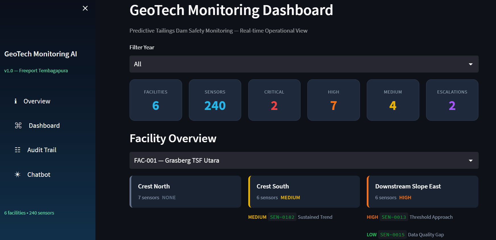

# GeoTech Sentinel - Predictive Tailings Dam Safety Agent

[](https://docs.snowflake.com/en/user-guide/cortex-code/cortex-code)
[]()
[](LICENSE)

> Built for the **Snowflake CoCo CLI Hackathon 2026** — Intelligent Workflow Automation Agent track

An agentic AI system that continuously reasons over geotechnical sensor data to catch structural drift in tailings storage facilities **before** it becomes a threshold breach — turning a reactive safety process into a predictive one, fully orchestrated through Snowflake Cortex Code (CoCo) CLI.

---



## Table of Contents

- [The Problem](#the-problem)
- [What It Does](#what-it-does)
- [Dashboard Features](#dashboard-features)
  - [Threshold & Scenario Simulator](#threshold--scenario-simulator)
  - [Human-in-the-Loop Dispatch](#human-in-the-loop-dispatch)
- [Design Principles](#design-principles)
- [Tech Stack](#tech-stack)
- [Repository Structure](#repository-structure)
- [Setup](#setup)
- [Demo](#demo)
- [Impact](#impact)
- [Roadmap](#roadmap)
- [License](#license)

---

## The Problem

Mine tailings storage facilities are monitored by hundreds of sensors (piezometers, inclinometers, survey prisms, extensometers). Industry practice today is largely **threshold-based**: an alert only fires once a reading crosses a hard design limit — by which point structural movement is often already underway.

Catastrophic tailings dam failures were preceded by **gradual, statistically detectable drift** that never tripped a single threshold, because no system correlated multiple sensors across a zone in real time. The cost of missing this signal isn't just financial — it's life-safety, environmental, and regulatory.

**This project asks:** Can an AI agent catch that pattern early, reason about *why* it matters given the specific facility's risk context, and route it to the right human — automatically?

---

## What It Does

A three-stage agentic pipeline, orchestrated entirely through CoCo CLI, from raw sensor time-series to a routed, actionable safety decision — with no manual triage for the majority of cases.

```
Sensor readings (Snowflake)
         |
         v
+---------------------------+
|   $geotech-drift-scan     |  Deterministic: trend regression, rate-of-change,
|   (Agent Skill)           |  cross-sensor correlation, threshold-approach forecast
+-------------+-------------+
              |
              v
+---------------------------+
| $geotech-risk-synthesis   |  LLM reasoning (scoped to flagged cases only):
|   (Agent Skill)           |  explains why it matters given facility risk class
+-------------+-------------+
              |
              v
+---------------------------+
| $geotech-action-          |  Deterministic branching: auto-monitor, schedule
|   orchestrator            |  inspection, or emergency escalation + Slack alert
+-------------+-------------+
              |
              v
Audit trail (Snowflake) + real-time Slack notification
```

A `PreToolUse` **hook** enforces the pipeline order at the tool-call level — the orchestrator cannot write a final decision for a case that hasn't been through risk synthesis, regardless of what the agent is asked to do.

---

## Dashboard Features

### Threshold & Scenario Simulator

Located on the **Dashboard** page, the simulator lets engineers interactively project how a sensor will behave under different environmental stress conditions — **before** a real event occurs.

**How it works:**
1. Select a sensor from the facility drill-down panel.
2. Adjust the **Alert Threshold** slider (±50% of the design threshold).
3. Choose a stress scenario:

| Scenario | Multiplier | Geotechnical Basis |
|----------|-----------|-------------------|
| Normal (current trend) | ×1.00 | Historical observed drift rate |
| Heavy Rainfall (+20% drift rate) | ×1.20 | Increased pore-water pressure accelerates consolidation |
| Seismic Event (+50% step spike) | ×1.50 | Sudden displacement event compresses timeline |
| Prolonged Drought (−30% reduced rate) | ×0.70 | Lower moisture reduces settlement rate |

**Output (5 metric cards):**

| Card | Description |
|------|-------------|
| **Sim. Threshold** | Adjusted alert threshold value |
| **Drift Rate** | Simulated daily drift rate (units/day) |
| **Est. Days to Breach** | Projected days until sensor reaches the threshold |
| **Risk Score** | Dynamic score 0–100 mirroring the live pipeline logic |
| **Severity** | CRITICAL / HIGH / MEDIUM / LOW from risk score |

A 180-day forecast chart overlays the threshold line for visual confirmation.

---

### Human-in-the-Loop Dispatch

Located on the **Case Audit Trail** page. After `$geotech-action-orchestrator` generates a `RECOMMENDED_ACTION`, a human engineer reviews the AI rationale and approves or rejects the dispatch before any field action is written — implementing a full **HITL** governance pattern.

**Dispatch workflow:**

```
AI recommends action
        |
        v
[Case Audit Trail — Dispatch Panel]
        |
        +-- Engineer reviews LLM rationale, risk score, days to breach
        +-- Selects: MONITOR / SCHEDULE_INSPECTION / URGENT_INSPECTION / EMERGENCY_ESCALATION
        +-- Assigns engineer from the facility's personnel roster
        |
        +-- Approve --> writes FINAL_ACTION + APPROVED_BY + APPROVED_TS to GEOTECH_AUDIT
        |               creates INSPECTION_LOG entry for inspection-type actions
        |
        +-- Reject  --> marks case REJECTED, queued for re-synthesis
```

**Governance fields written per approved dispatch:**

| Field | Description |
|-------|-------------|
| `FINAL_ACTION` | The actual action taken |
| `APPROVED_BY` | Approving engineer's name |
| `APPROVED_TS` | Timestamp of approval |
| `APPROVAL_STATUS` | `APPROVED` or `REJECTED` |
| `ASSIGNED_ENGINEER` | Engineer dispatched to site |

All writes are **idempotent** — re-running the orchestrator on an already-approved case will not overwrite the decision.

---

## Design Principles

| Principle | How It's Applied |
|-----------|-----------------|
| **Deterministic where possible** | Detection (Stage 1) and action routing (Stage 3) are pure SQL/statistics — auditable, cheap, reproducible. The LLM is invoked only where judgment is genuinely needed. |
| **Leading indicator, not lagging alarm** | Detection targets sustained trend + cross-sensor correlation + threshold-approach forecasting, not just breach detection. |
| **Governance is enforced, not documented** | The pipeline-order rule lives in a hook that can block a tool call. |
| **Every decision is traceable** | Every case carries its detection pattern, risk score, LLM rationale, and final action. |
| **Humans are notified where it matters** | High-severity cases push a real-time Slack alert via MCP, not just a database row. |

---

## Tech Stack

| Layer | Technology |
|-------|-----------|
| Data warehouse | **Snowflake** — tables in `GEOTECH.CORE` |
| Agent runtime | **Cortex Code (CoCo) CLI** — 3 custom Agent Skills + 1 governance hook + Slack MCP integration |
| Operational dashboard | **Streamlit in Snowflake** |

---

## Repository Structure

```
.
├── AGENTS.md                   # Agent pipeline documentation
├── architecture.md             # System architecture overview
├── README.md
│
├── cortex/
│   └── hooks/
│       ├── hooks.json
│       └── validate-geotech-pipeline.sh
│
├── skills/
│   ├── geotech-drift-scan/SKILL.md
│   ├── geotech-risk-synthesis/SKILL.md
│   └── geotech-action-orchestrator/SKILL.md
│
├── streamlit/                  # Operational dashboard (SiS)
│   ├── streamlit_app.py
│   ├── requirements.txt
│   ├── .streamlit/config.toml
│   ├── components/
│   │   └── styles.py
│   ├── utils/
│   │   └── data.py
│   └── views/
│       ├── overview.py
│       ├── dashboard.py
│       ├── audit_trail.py
│       └── chatbot.py
│
└── .snowflake/
    └── cortex/plans/
```

---

## Setup

### 1. Snowflake

Run the schema setup and seed data:

```sql
-- Run in a Snowflake worksheet or via CoCo
SOURCE sql/01_schema.sql;
```

Then run the prompts in `sql/02_synthetic_data_prompts.md` inside a CoCo session to generate synthetic sensor data.

### 2. CoCo CLI

```bash
cortex connections set <your_account>
cd geotech-agent
cortex
```

Inside the CoCo session, run the pipeline in order:

```
$geotech-drift-scan run for GEOTECH.CORE last 18 months
$geotech-risk-synthesis analyze flagged cases
$geotech-action-orchestrator execute decisions
```

### 3. Streamlit Dashboard

The operational dashboard is deployed as **Streamlit in Snowflake (SiS)** and accessible directly from Snowsight. No local setup required.

---

## Demo

[Demo video](#) — end-to-end run: scan, synthesize, route, Slack alert, audit trail.

| Screenshot | Description |
|-----------|-------------|
|  | Facility overview dashboard |
|  | Streamlit chatbot querying sensor data |
|  | Live Slack alert on a CRITICAL case |


---

## Impact

Tailings dam failures are catastrophic and rare — which is exactly why leading indicators matter more than lagging alarms. On a synthetic 240-sensor / 6-facility dataset modeled on real monitoring practice, this pipeline:

- Surfaces cross-sensor correlated drift well before a threshold breach would trigger a conventional alarm
- Resolves the majority of flagged cases as routine monitoring or scheduled inspection with no human triage required

---

## Roadmap

- Real sensor ingestion via Snowflake native connectors
- Subagent-based parallel case analysis for larger sensor fleets
- Two-way Slack (acknowledge/escalate from the alert thread itself)

---

## License

MIT — see [LICENSE](LICENSE)

---

## Author

Built by **Simon** — AI Engineer
